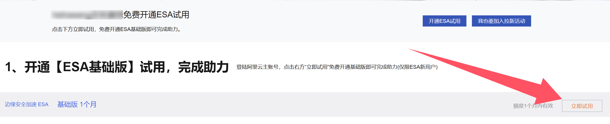
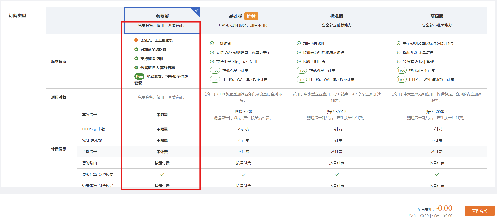
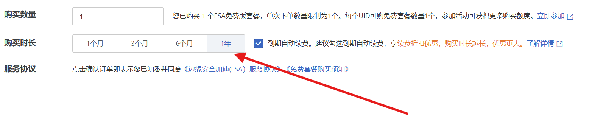

我们做小项目的独立开发者，最头疼的就是成本问题了。最近，我发现了一个**阿里云的超级羊毛**，简直是为我们量身定做的——**国内免费 CDN 套餐**，而且操作一下，就能**直接续到 2050 年！**

## 整个过程非常简单

* **找到活动入口：** https://tianchi.aliyun.com/specials/promotion/freetier/esa?taskCode=25254&recordId=64a382a5e17620cead58c1d85499467b

* 点击该链接，选择**基础版**，一个月，购买

* **定位免费套餐：** 重新点击页面上的“**立即试用**”按钮。这时候，页面会弹出一个包含多个版本的选项。**切记**！在这里一定要选择那个标注着 **0 元的“免费版”**。

* **完成 0 元购买：** 跟随流程，时间选择1年，开启自动把这个免费套餐添加到你的账户中。

假如你相信阿里云，此时薅羊毛已经完成了，后续到结账日会自动续费。如果你担心明年规则变动导致无法免费续杯，现在的手动堆叠续费大法就是你的定心丸：

1. 购买完成后，进入阿里云控制台的 **[【套餐管理】](https://billing-cost.console.aliyun.com/subscription/overview/list)** 页面，找到 ESA 订阅。

2. 找到你刚刚 0 元购入的 ESA/CDN 套餐。

3. 点击右侧的 **续费** 按钮。

4. **见证奇迹的时刻**： 在续费页面，将时长选为 **1 年**。你会发现，价格依然显示 0.00 元！

5. 点击支付，完成续费。

6. **重复操作：** 既然是 0 元，那就不要客气。重复上述续费 1 年的操作约 **25 次**。

恭喜你！你的套餐到期时间将显示为 **2050 年**。半辈子的 CDN 都不用愁了！

## 赶紧行动

这种云计算大厂的羊毛福利，**往往都有时间限制**，或者随时可能调整规则。如果你手上有需要加速的国内项目，别犹豫了，先把这个 2050 年的免费 CDN 名额拿到手！

祝大家薅毛愉快，项目跑得飞快！